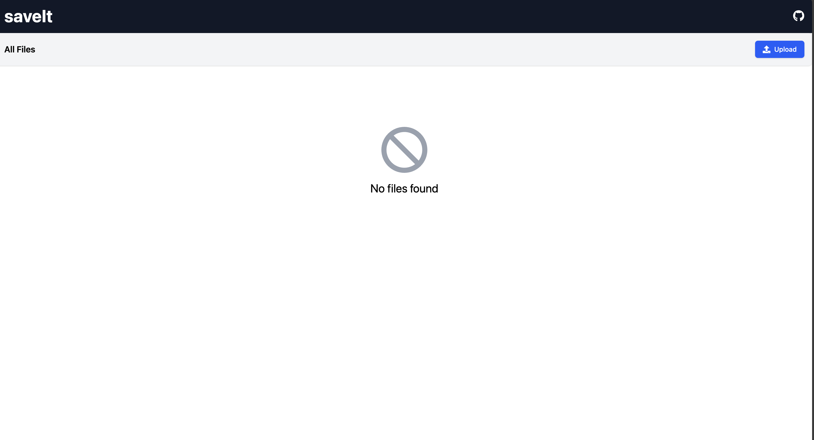
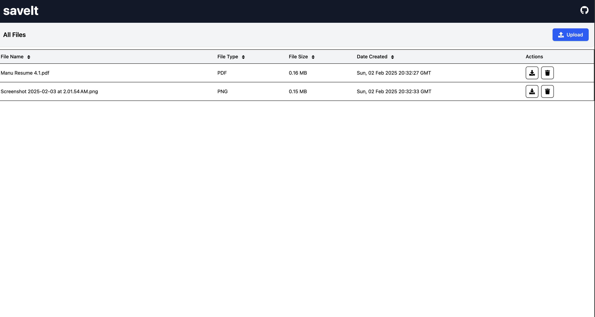

# SaveIt Frontend

This is the frontend repository for the SaveIt application. SaveIt is a web application designed to help users save and manage their personal data securely.

## Description

The SaveIt frontend is built using modern web technologies to provide a seamless and responsive user experience. It interacts with the SaveIt backend to perform various operations such as user authentication, data retrieval, and data management.

## Screenshots





## How to Run

To run the SaveIt frontend locally, follow these steps:

1. **Clone the repository:**
  ```bash
  git clone https://github.com/yourusername/saveIt-frontend.git
  cd saveIt-frontend
  ```

2. **Install dependencies:**
  ```bash
  npm install
  ```

3. **Start the development server:**
  ```bash
  npm start
  ```

4. Open your browser and navigate to `http://localhost:5173` to see the application in action.

## Features

- **File Upload**: Users can upload files to the server using the upload button.
- **File Download**: Users can download files by clicking the download button next to each file.
- **File Delete**: Users can delete files by clicking the delete button next to each file.
- **Sorting**: Users can sort files based on multiple criteria such as file name, file type, file size, and upload date.

## Tech Used

- **React**: A JavaScript library for building user interfaces.
- **Redux**: A predictable state container for JavaScript apps.
- **Axios**: A promise-based HTTP client for making API requests.
- **React Router**: A collection of navigational components for React applications.
- **Material-UI**: A popular React UI framework for building responsive and visually appealing interfaces.

## Contributing

We welcome contributions to the SaveIt frontend project. If you have any suggestions or improvements, please create a pull request or open an issue.

